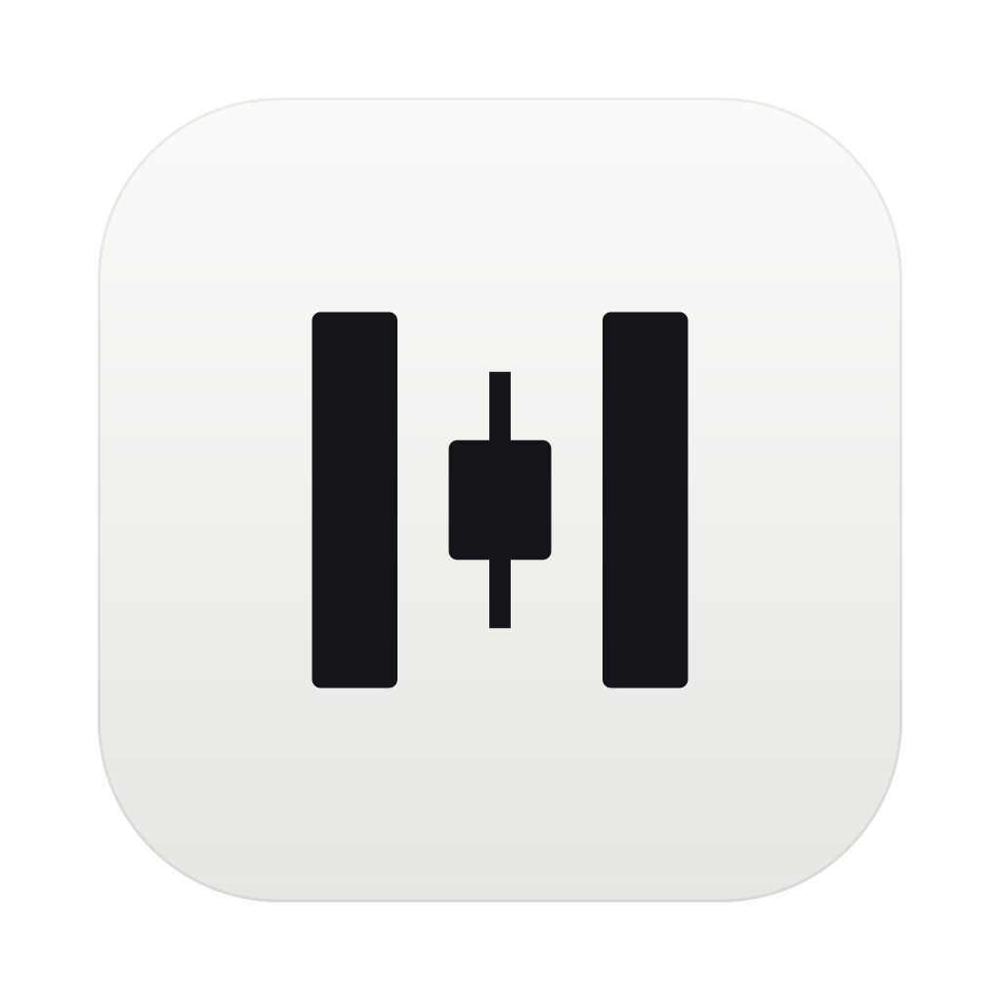
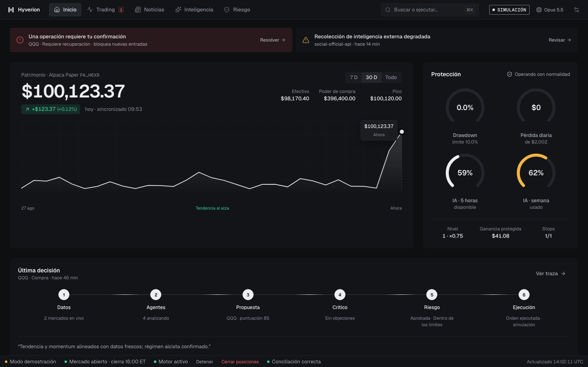

<p align="center"></p>

<h1 align="center">Hyverion Quant AI</h1>

<p align="center">
  <a href="https://github.com/CRistin737/hyverion-quant-ai/actions/workflows/ci.yml"></a>
  <a href="LICENSE"></a>
</p>

Hyverion Quant AI is a macOS desktop app plus a Python core that runs a year-long **paper-trading**
campaign on **QQQ** (the Nasdaq-100 ETF). A team of AI agents, running on your own Claude or Codex
subscription, reads the market, macro calendar, Nasdaq-100 breadth and news, and proposes trades. A
deterministic risk engine has the final say, and a single execution engine is the only component
that can talk to the broker (an Alpaca **Paper** account). The system improves its own strategy by
trial and error, but only through validated, reversible changes, and LIVE trading is locked.

Website: <https://cristin737.github.io/hyverion-quant-ai>



## How it works

```text
DATA -> AGENTS -> PROPOSAL -> CRITIC -> RISK -> EXECUTION -> BROKER
```

- **Data**: Alpaca market data (IEX), official macro calendars (Fed, BLS, BEA), SEC EDGAR, FRED,
  news and RSS. External text is treated as untrusted data, never as instructions.
- **Agents**: provider-neutral specs in [`agents/`](agents/). Sonnet analyzes; Opus decides and
  improves. A failed provider chain produces `NO_TRADE`.
- **Risk**: `RiskEngine` is deterministic and has final authority. AI code never receives a broker
  client.
- **Execution**: `ExecutionEngine` is the only component that submits, replaces or cancels orders.

Hard rails that nothing (not the AI, not the app) can relax:

- LIVE is locked; this release has no live broker adapter.
- Every position has a native broker stop (GTC) and deterministic exits that work without AI.
- Emergency stop / flatten always works.
- Weekly loss limit and maximum drawdown always stop new entries.
- No martingale, revenge trading, unlimited DCA or loss-recovery sizing.
- Missing or stale data, a stale macro calendar, stale broker equity or a failed reconciliation
  block new entries.
- Every AI-tunable value stays inside the envelope in [`config/autonomy.yaml`](config/autonomy.yaml),
  which only a human can widen.

The full rule set lives in [`AGENTS.md`](AGENTS.md).

## Features

- One instrument: QQQ, long-only, regular New York session, flat before the close.
- Risk profiles as a percentage of the Alpaca Paper equity (Conservative / Medium / High; Medium is
  0.5 % per trade, 2 % per day, 5 % per week).
- Restart reconciliation with Alpaca every 10 minutes; any mismatch blocks entries (safe mode).
- AI via official subscription CLIs (Claude Code, Codex; Grok and Gemini optional) with ordered
  fallbacks and live 5-hour / weekly usage bars. No API keys required.
- Self-improvement: the nightly improver proposes parameter, prompt or feature changes. In paper,
  parameter changes are promoted automatically only after replay, out-of-sample and 5-session
  shadow validation beat the champion, with one-click rollback. Prompts and new code always wait for
  the owner.
- Three-layer memory (operations, lessons, knowledge vault) with a local embedding model.
- Background engine as a macOS `launchd` service with a daily routine in New York time.
- Period reports (day, month, year, range) with CSV and PDF export.
- Spanish user interface; English code and identifiers.

## Requirements

- macOS 14 or later (Apple Silicon or Intel)
- Python 3.12 and [uv](https://docs.astral.sh/uv/)
- Node.js 22 and [pnpm](https://pnpm.io/)
- Rust (stable) for Tauri 2
- A Claude or Codex subscription with its official CLI installed and logged in
  (`claude` or `codex`)
- A free [Alpaca](https://alpaca.markets/) **Paper** trading account

## Quick start

```bash
git clone https://github.com/CRistin737/hyverion-quant-ai.git
cd hyverion-quant-ai
uv sync
cd app && pnpm install && pnpm tauri dev
```

The app starts its own Python core on loopback and opens the onboarding: connect Alpaca Paper
(keys go straight to the macOS Keychain), choose the AI subscription and pick a risk profile.
The step-by-step Spanish guide is [`docs/es/GUIA.md`](docs/es/GUIA.md).

Useful CLI commands (also available as the `hyverion-quant-ai` console script):

```bash
uv run python -m trading_bot doctor           # environment, broker and safety checks
uv run python -m trading_bot broker status    # must report "environment": "paper"
uv run python -m trading_bot service install  # run the engine as a background service
```

To build the standalone `.app`: `cd app && pnpm build:app` (see [`docs/MACOS_APP.md`](docs/MACOS_APP.md)).

Developer quality gate:

```bash
uv sync --extra dev
uv run ruff check . && uv run mypy src && uv run pytest
cd app && pnpm typecheck && pnpm test
```

## Where your data lives

Nothing personal is stored in the repository. Secrets live in the macOS Keychain; settings, the
SQLite database, backups and logs live under `~/Library/Application Support/Hyverion Quant AI/`
(or the gitignored `data/` folder when running from a checkout). Details:
[`docs/SECURITY.md`](docs/SECURITY.md).

## Documentation

- [Spanish user guide](docs/es/GUIA.md)
- [Architecture](docs/ARCHITECTURE.md)
- [Risk model](docs/RISK_MODEL.md)
- [AI providers](docs/PROVIDERS.md)
- [macOS app](docs/MACOS_APP.md)
- [Specification, decisions and status](spec/README.md)
- [Operator guides](spec/guides/README.md)

## Contributing, security and license

- [Contributing](CONTRIBUTING.md) and [Code of Conduct](CODE_OF_CONDUCT.md)
- [Security policy](SECURITY.md): report vulnerabilities privately
- Licensed under the [Apache License 2.0](LICENSE); see also [`NOTICE`](NOTICE)
- "Hyverion" and its logo are not licensed under Apache-2.0; see [`TRADEMARKS.md`](TRADEMARKS.md)

## Disclaimer

Hyverion Quant AI is experimental software for research and education. **It is not financial
advice** and it does not guarantee any profit; a day without trades is a valid outcome. It is
designed and tested for **paper trading only**. LIVE trading is locked and unsupported in this
release. The software is provided "as is", without warranty of any kind (see the license). You are
solely responsible for how you use it and for any decision you make with it.
